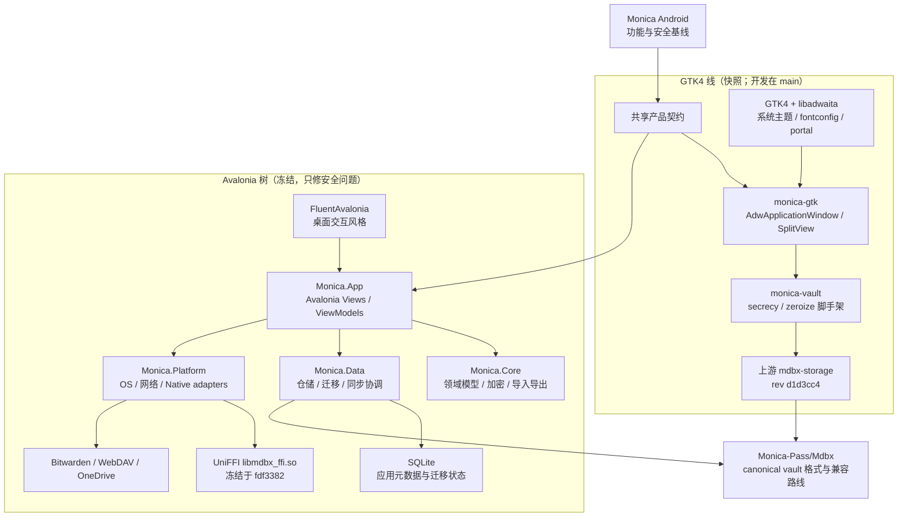

# Monica by Linux — Avalonia 线（已冻结）

> ## 🔒 本分支已冻结：`avalonia-frozen`
>
> 这是 `.NET 10 + Avalonia 12 + FluentAvalonia` 实现线的最终状态。
> **只接受安全修复，不接新功能。**
>
> - **活跃开发在 `main` 分支**（Rust + GTK4 / libadwaita）。起因见
>   [RFC #8](https://github.com/6078HITHEDAY/Monica-by-Linux/issues/8)，决议见
>   [D1 评论](https://github.com/6078HITHEDAY/Monica-by-Linux/issues/8#issuecomment-5707570676)。
> - 冻结点 tag：`avalonia-final`。
> - 维护流程、分支边界与保护建议见 [FROZEN.md](FROZEN.md)。
>
> 下面所有内容描述**本分支**。GTK4 线的文档在 `main` 分支。

<p align="center">
  
</p>

<p align="center">
  <strong>Monica 的本地优先桌面密码库：以 Android 主应用为功能与安全基准，
  本分支为 .NET + Avalonia 实现线（已冻结，只收安全修复）。</strong>
</p>

<p align="center">
  <a href="https://github.com/6078HITHEDAY/Monica-by-Linux/actions/workflows/check.yml?query=branch%3Aavalonia-frozen">
    
  </a>
  
  
  
</p>
* 这是一个个人维护的，给自己使用的Linux版本

## 产品定位

Monica by Linux 是 Monica 的 **Linux 桌面**实现。本仓库只维护 Linux 目标，构建或发布
deb、rpm、AppImage、Flatpak 包。

- **产品与安全基线来自 Monica Android。** 数据格式、核心能力、安全边界和兼容路线
  以主应用为准。
- **桌面交互沿用 FluentAvalonia 任务布局。** 这是本分支的实现方式，也是它的已知代价：
  它把 WinUI / Fluent 的假设带到了 Linux 上（深色主题白块、字体回退、能力状态硬编码）。
  后继的 GTK4 线正是为消除这些假设而重写，见下文「为什么冻结」。
- **Vault 业务数据以 canonical MDBX 为准。** SQLite 保留应用元数据、迁移状态和集成
  记账，不作为解锁后 vault 业务数据的双重真源。

本仓库不会生成 Android、iOS、Windows 或 macOS 包。Monica Android 仍由
[Monica 主仓库](https://github.com/Monica-Pass/Monica)独立维护和发布。

## 分支布局

| 分支 | 技术栈 | 状态 |
| --- | --- | --- |
| **`avalonia-frozen`（本分支）** | .NET 10 + Avalonia 12 + FluentAvalonia | **冻结**：只收安全修复 |
| `main` | Rust + gtk4-rs / libadwaita-rs | 活跃开发中（Phase 0 已完成） |

本分支的 Avalonia 实现**仍然产出可分发的 Linux 包**（deb / rpm / AppImage / Flatpak），
这也是它保留 CI 的原因：安全修复必须还能出包。新功能一律进 `main`。

`monica-gtk/` 目录在本分支里是**冻结当时的快照**，不再更新；它的开发在 `main` 上继续。

## 为什么冻结

Issue #7 收集到的问题（深色主题白块、中文字体回退、i18n 缺 key、能力状态硬编码）有一个
共同根因：把 WinUI / Fluent 的假设搬到了 Linux 上。逐个打补丁不如换用对的 toolkit，于是
有了 [RFC #8](https://github.com/6078HITHEDAY/Monica-by-Linux/issues/8) 与 GTK4 重写。

RFC 的 D1 曾建议先试 C# + Gir.Core，以便**进程内复用本分支的 `Monica.Core` /
`Monica.Data`**；**该建议已作废，改用 Rust**，代价正是这两层不在进程内复用、要在 Rust
侧重写。决议与实测证据记录在
[issue #8 的 D1 评论](https://github.com/6078HITHEDAY/Monica-by-Linux/issues/8#issuecomment-5707570676)。

分阶段计划与当前 Phase 状态在 `main` 分支的 README 上维护，本分支不再重复。

## 主要能力

本分支已实现的能力：

| 工作区 | 已实现能力 |
| --- | --- |
| 密码库 | 密码、用户名、网址、自定义字段、附件、收藏、归档、回收站、批量操作和可嵌套分类目录 |
| 动态口令 | TOTP/HOTP、二维码导入与扫描、搜索、收藏、编辑和安全复制 |
| 安全笔记 | 多标签编辑、Markdown 预览、图片附件、嵌套目录和草稿恢复 |
| 钱包 | 银行卡、身份资料、证件、登录条码、账单地址及其他 Android 对应类型 |
| 安全分析 | 弱密码、重复密码、泄露检查入口和按风险优先级组织的处理流程 |
| 导入导出 | Monica JSON、CSV、Bitwarden JSON、KeePass KDBX、Aegis 等迁移路径 |
| 同步与备份 | Bitwarden 在线账户同步、WebDAV 备份恢复、OneDrive MDBX 传输和冲突保护 |
| 桌面集成 | Linux 托盘、浏览器桥、Secret Service 设置加密、文件选择器和安全剪贴板；全局快捷键与截图保护按能力受限 |
| 浏览器配对 | Chrome/Edge Manifest V3 扩展、仅回环地址的会话令牌桥接和当前站点凭据查询 |
| MDBX 工具 | Vault 创建、检查、快照、历史、冲突、恢复和数据库管理工作台 |

Bitwarden 在线同步包括账户认证、支持的双因素挑战、待上传变更、远端下载与合并、
嵌套文件夹元数据和冲突备份。协议兼容与安全限制记录在
[Bitwarden 在线同步边界](docs/bitwarden-online-sync-boundary.md)。

## 架构与维护边界



两棵树写同一份 canonical MDBX，但接近方式不同：冻结树走冻结的 UniFFI `.so`，GTK4 树走
上游 `mdbx-storage` 的 git 依赖。两者**目前不做 ABI 对齐**。GTK4 树对现有 Avalonia
`local.mdbx` 只做**只读**检查（上游 `inspect_migration`）；一旦发现需要从 `MDBX-1` 升到
`MDBX-2`，会拒绝就地打开，要求先复制或备份。

### GTK4 线（本分支内只是快照；开发在 `main`）
| --- | --- |
| `monica-gtk/crates/monica-gtk` | GTK4 / libadwaita 外壳：`AdwApplicationWindow`、`AdwNavigationSplitView` 工作区列表、中文解锁表单 |
| `monica-gtk/crates/monica-vault` | Rust 侧 vault 封装：创建 / 打开 / 解锁、只读 `inspect_migration`，以及 `secrecy` + `zeroize` 密钥脚手架 |

### 本分支的项目
| --- | --- |
| `src/Monica.App` | Avalonia 窗口、按功能拆分的 Views/ViewModels、对话框与桌面服务编排 |
| `src/Monica.Core` | 不依赖 UI 和存储实现的领域模型、密码学策略、TOTP、导入导出与同步契约 |
| `src/Monica.Data` | canonical MDBX 仓储、SQLite 元数据、迁移、Bitwarden 队列与冲突处理 |
| `src/Monica.Platform` | Linux 能力、HTTP 传输、WebDAV/OneDrive、KeePass 与 MDBX UniFFI |
| `tests/Monica.Tests` | 核心、数据、平台、安全和真实子进程集成测试 |
| `tests/Monica.UiTests` | Avalonia Headless 交互、性能、内存、键盘和页面组成测试 |

商业质量门限制重点功能文件的体积，避免主窗口或单个 ViewModel 再次演变成难以维护的
“万能文件”。业务规则必须留在 Core/Data/Platform 的明确边界中，UI 只负责桌面状态投影
与用户操作编排。该门禁约束的是本分支的 `Monica.App`；GTK4 线的等效约束随 main 上的 CI
工作引入。

## 安全模型

以下边界描述本分支当前实现。GTK4 线的等效边界仍在建设中（那边只完成了 Phase 0 脚手架），
**不要把下列能力当作 GTK4 线已有的保证**；其现状见 `main` 分支的 README。

- 主密码只在需要的生命周期内参与密钥派生；解锁会话结束时释放 MDBX handle，并清理
  可清理的凭据指纹和短期密钥材料。
- 锁定、最小化后台释放和退出流程会移除敏感视觉树、详情缓存、预热编辑器和临时秘密。
- 安全剪贴板只清理由 Monica 写入且仍由 Monica 拥有的内容，避免覆盖用户后来复制的文本。
- 浏览器桥接仅监听 IPv4 loopback，使用每次解锁生成的 256 位随机令牌；锁定、禁用、
  改端口、退出或重启都会撤销令牌。
- Bitwarden endpoint、KDF 参数、CipherString 长度和认证类型均受显式策略限制；账户秘密、
  待同步载荷、错误和冲突备份使用 Monica vault AEAD envelope 持久化。
- Linux 截图保护按平台能力保持不可用；设置页可见但开关禁用。
- Linux 桌面不探测系统 WebAuthn / Credential Provider。原生 passkey 能力报告为
  Unsupported，不会把桌面 passkey 状态误报为 Android Credential Provider 等价能力。

详细边界：

- [发布就绪与证据矩阵](docs/release-readiness.md)
- [浏览器桥接协议](docs/browser-bridge-protocol.md)
- [Bitwarden 在线同步边界](docs/bitwarden-online-sync-boundary.md)
- [原生 Passkey 平台边界](docs/native-passkey-boundary.md)

## 构建与运行

> GTK4 线的构建方式见 `main` 分支的 README。本分支只讲 Avalonia 线。

### 环境要求

- .NET SDK 10.0 或更高版本
- Linux 桌面环境（开发与发布目标）
- PowerShell 7，用于统一验证与发布脚本
- `libsecret` 开发库（Secret Service 设置加密）
- 仅在开发 MDBX CLI 回退时需要 Rust toolchain

### 还原与构建

从仓库根目录执行：

```powershell
cd ".\monica by avalonia"
dotnet restore Monica.slnx
dotnet build Monica.slnx --configuration Release
```

### 运行桌面应用

```powershell
dotnet run --project "src\Monica.App\Monica.App.csproj"
```

### Linux 安装与运行

Release 草稿包提供这些 Linux 产物：

- `.deb`（Debian/Ubuntu 系）
- `.rpm`（Fedora/RHEL/openSUSE 等）
- `.AppImage`（通用可执行包）
- `.flatpak`（沙箱包）

Debian/Ubuntu 示例：

```bash
sudo apt install ./Monica-*-linux-x64-jit.deb
monica
```

Fedora/RHEL 示例：

```bash
sudo dnf install ./Monica-*-linux-x64-jit.rpm
monica
```

AppImage 示例：

```bash
chmod +x ./Monica-*-linux-x64-jit.AppImage
./Monica-*-linux-x64-jit.AppImage
```

Flatpak 示例：

```bash
flatpak install --user ./Monica-*-linux-x64-jit.flatpak
flatpak run com.monicapass.Monica
```

Linux 桌面集成说明：

- WebDAV 等敏感设置使用 Secret Service（`libsecret`）包装密钥；需要可用的会话密钥环。
- 托盘依赖 StatusNotifier/AppIndicator。GNOME 可能需要 AppIndicator 扩展。
- 浏览器扩展桥接在 Linux 上可用；全局快捷键与截图保护仍按平台能力显示为受限。
- `.desktop` 使用 `StartupWMClass=monica`，与 Avalonia X11 `WmClass` 对齐。

## 测试与质量门

下列命令与质量门都作用于本分支。GTK4 线的 CI 在 `main` 分支上单独维护。

核心与集成测试使用普通 `dotnet test`：

```powershell
dotnet test "tests\Monica.Tests\Monica.Tests.csproj" --configuration Release
```

完整验证必须使用统一脚本。它会执行仓库卫生检查、重点文件体积限制、格式验证、
NuGet 直接与传递依赖漏洞审计、Release 零警告构建、核心测试、冷启动预算和其余
Avalonia Headless UI 套件，全程不会打开可见应用窗口。

```powershell
.\eng\ci\verify-commercial-release.ps1 -Configuration Release
```

通过结果、快照产出日期与剩余边界以[发布就绪与证据矩阵](docs/release-readiness.md)为准 ——
本文件不再重复抄写计数，避免两处数字各自漂移。**注意**：矩阵里的 `630/630` 计数产出于
2026-07-26，早于 Linux-only 改造（`f9fa194`）与 GTK4 Phase 0（`4c88009`）；发布前必须重跑
`eng/ci/verify-commercial-release.ps1` 刷新，不要把历史计数当作当前状态。该计数也不替代
发布前在目标发行版上的安装、辅助技术、窗口管理和真实硬件性能测试。

## 发布与分发边界

本分支的发布链路仍然有效，这也是它保留 CI 的原因：安全修复必须还能出包。GTK4 线在
Phase 5 之前**没有**任何可分发产物。

- Release 工作流默认生成 **JIT** `linux-x64` 包；NativeAOT 仍是实验选项，不作为默认商业构建。
- Linux 产物通过质量门后只会创建 **GitHub Draft Release**（portable tar.gz、`.deb`、`.rpm`、AppImage、Flatpak）。
- 每个草稿 Release 包含 `SHA256SUMS`，并由 GitHub build provenance attestation
  关联到当前工作流运行。
- 当前仓库不生成 Windows / macOS 安装包；Linux 发行仓库元数据与仓库签名仍属外部待完成项。
  在信任链完成并实测前，不应把草稿产物宣传为正式公开安装包。
- GitHub 分支保护、漏洞警报、秘密扫描、推送保护和组织级 Action allow-list 属于远端
  管理员设置，不会由仓库文件静默开启。

本地 JIT 预览包示例：

```powershell
dotnet publish "src/Monica.App/Monica.App.csproj" `
  --configuration Release `
  --runtime linux-x64 `
  --self-contained true `
  /p:PublishAot=false
```

项目声明的运行时目标为 `linux-x64` 与 `linux-arm64`。Release CI 默认只发布
`linux-x64`。声明目标不等于每个架构已经完成人工验收，具体状态以
[发布就绪矩阵](docs/release-readiness.md)为准。

## MDBX 开发

本分支优先使用 native UniFFI bridge，绑定冻结在 `fdf3382`。GTK4 线不走这条路径（它直接
git 依赖上游 `mdbx-storage`）；两条线**不做 ABI 对齐**，这是已知且接受的边界。

应用优先使用 native UniFFI bridge。开发环境需要显式测试 CLI 回退时，可设置：

```powershell
$env:MONICA_MDBX_WORKSPACE = "/path/to/Mdbx"
$env:MONICA_MDBX_CLI = "/path/to/Mdbx/target/debug/mdbx"
```

Linux 发布所用的原生库 `src/Monica.Platform/Mdbx/runtimes/libmdbx_ffi.so` 由 MDBX 仓库的
**fdf3382**（"Expose MDBX UniFFI bindings for C# clients"）构建。该提交把 `uniffi` 锁定为
`"=0.29.4"`，与 `src/Monica.Platform/Mdbx/Generated/mdbx_ffi.cs`（由 uniffi-bindgen-cs
v0.10.0+v0.29.4 生成，contract version 29）ABI 一致。tag `MDBX1.0` / `MDBX2.0` /
`v3.0.0-alpha.1` 与 master 均已升到 uniffi 0.31.1，**不能**用于当前绑定；fdf3382 次日被
revert（849bb99），因此只能按 SHA 取用。更换绑定时必须同步更换该提交。

```bash
git clone https://github.com/Monica-Pass/Mdbx.git && cd Mdbx
git checkout fdf3382
cargo build -p mdbx-ffi --release
# 自检：应输出 mov $0xceaf,%ax（create_vault checksum 52911，与绑定期望一致）
objdump -d --disassemble=uniffi_mdbx_ffi_checksum_func_create_vault \
  target/release/libmdbx_ffi.so | grep -o 'mov *\$0x[0-9a-f]*,%ax' | head -1
cp target/release/libmdbx_ffi.so \
  "monica by avalonia/src/Monica.Platform/Mdbx/runtimes/libmdbx_ffi.so"
```

构建依赖：Fedora `sudo dnf install rust cargo`；Debian/Ubuntu 用 rustup 即可，无额外系统库。

MDBX 客户端必须通过 storage/repository API 或明确的 FFI facade 维护 commit、
object version、tombstone、snapshot、conflict 和 device head 等元数据。不要把
MDBX 当作普通 SQLite 表直接改写。

更多规范：

- [MDBX 仓库](https://github.com/Monica-Pass/Mdbx)
- [MDBX 客户端接入指南](https://github.com/Monica-Pass/Mdbx/blob/master/CLIENT_INTEGRATION_GUIDE.zh-CN.md)
- [MDBX 规范索引](https://github.com/Monica-Pass/Mdbx/blob/master/docs/README.zh-CN.md)

## 浏览器扩展

`browser-extension/` 包含用于本地开发和配对验证的 Chrome/Edge Manifest V3
扩展。它目前通过开发者模式加载，不代表已经在浏览器商店签名发布。安装、令牌生命周期
和限制见[浏览器扩展说明](browser-extension/README.md)。

## 项目关系

- [Monica](https://github.com/Monica-Pass/Monica)：Android 主应用、产品与安全基线。
- [MDBX](https://github.com/Monica-Pass/Mdbx)：Monica 的本地优先 vault 格式与长期兼容路线。
- **Monica by Linux（本仓库）**：仅维护 Linux 桌面的 Monica 密码库实现。分支划分见上文
  「分支布局」。上游原仓库为
  [Monica-Pass/Monica-by-Avalonia](https://github.com/Monica-Pass/Monica-by-Avalonia)。

## 致谢

本项目使用或参考 Avalonia、FluentAvalonia、Bitwarden、KeePass、QRCoder、ZXing、
Otp.NET、Bouncy Castle、Dapper 和 Microsoft Graph 等开源生态。本分支内
`monica-gtk/`（不再更新的快照）还带有 GTK4、libadwaita、gtk4-rs、libadwaita-rs、
rusqlite、secrecy、zeroize 依赖。具体许可与声明见
[THIRD-PARTY-NOTICES.md](THIRD-PARTY-NOTICES.md)。

## 许可证

本项目基于 [GNU General Public License v3.0](LICENSE) 开源发布。
