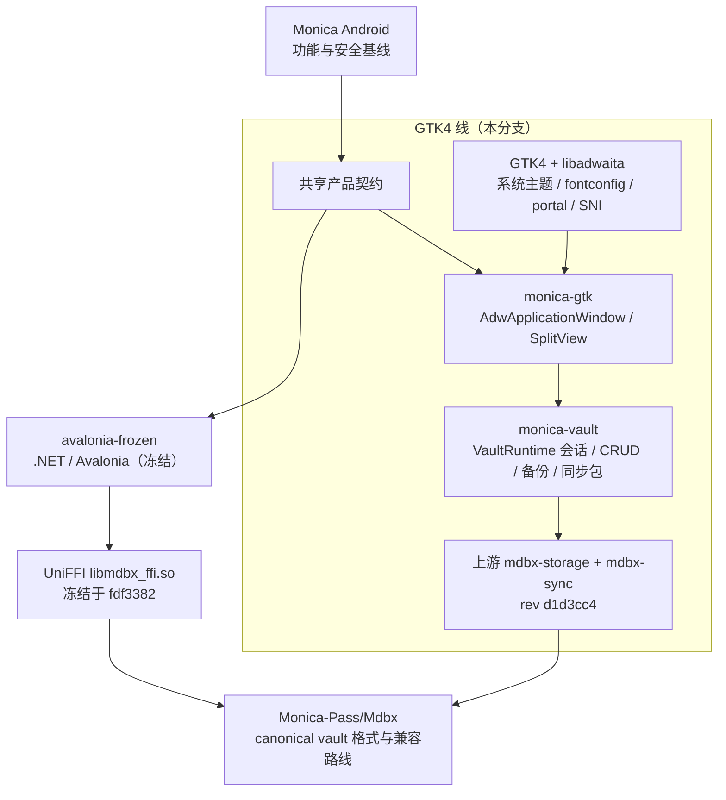

# Monica by Linux

<p align="center">
  
</p>

<p align="center">
  <strong>Monica 的本地优先桌面密码库：以 Android 主应用为功能与安全基准，
  以 GTK4 + libadwaita 作为桌面交互设计基准。</strong>
</p>

<p align="center">
  <a href="https://github.com/6078HITHEDAY/Monica-by-Linux/actions/workflows/check-gtk.yml">
    
  </a>
  
  
  
</p>

* 这是一个个人维护的，给自己使用的 Linux 版本

## 分支布局

| 分支 | 技术栈 | 状态 |
| --- | --- | --- |
| **`main`（本分支）** | Rust + gtk4-rs / libadwaita-rs | **活跃开发中**，Phase 0–5 已落地（Phase 3 在线同步仍阻塞） |
| `avalonia-frozen` | .NET 10 + Avalonia 12 + FluentAvalonia | **冻结**：只收安全修复 |

> GTK4 线现在能打 **Flatpak（GNOME runtime）/ deb / RPM**，见
> [`packaging/README.md`](packaging/README.md)。冻结线仍维护 Avalonia 包，流程见
> [FROZEN.md](FROZEN.md)。 Avalonia 树本身不在本分支重写。

## 产品定位

Monica by Linux 是 Monica 的 **Linux 桌面**实现，只维护 Linux 目标。

- **产品与安全基线来自 Monica Android。** 数据格式、核心能力、安全边界和兼容路线以主
  应用为准。
- **桌面交互以 GTK4 + libadwaita 为基准。** 深浅色与 accent 跟随系统，字体走 fontconfig
  家族名，平台能力走 portal / D-Bus —— 而不是把 WinUI / Fluent 的假设搬到 Linux 上。
- **Vault 业务数据以 canonical MDBX 为准。** 直接使用上游 `Monica-Pass/Mdbx` 的
  `mdbx-storage`，不再经过 UniFFI 包装层。

本仓库不会生成 Android、iOS、Windows 或 macOS 包。Monica Android 仍由
[Monica 主仓库](https://github.com/Monica-Pass/Monica)独立维护和发布。

## 为什么重写

本仓库在 Linux 上收集到的问题（[issue #7](https://github.com/6078HITHEDAY/Monica-by-Linux/issues/7)）
有一个共同根因：把 Windows 的假设当成了世界本身。

| 债务 | 旧实现的表现 | GTK4 + libadwaita 下 |
| --- | --- | --- |
| 主题 | 自定义 token 落在非主题条目 → 深色下白块、白字白底不可见 | 主题由 toolkit 提供，跟随系统 |
| 字体 | 字体栈首选 Segoe UI / 微软雅黑 → Linux 落进等宽回退 | fontconfig 家族名 + 系统 CJK 回退 |
| 图标 | 窗口/托盘用 `.ico`，打包另起一份 PNG | hicolor 多尺寸，`.desktop` 直接 `Icon=` |
| 依赖 | 发布包曾携带 Windows PE 的 `mdbx_ffi.dll` | 原生库随包，Flatpak 走 GNOME runtime |
| 能力 | 能力状态硬编码，全局快捷键被标"平台受限" | portal / D-Bus 直接对接 |
| 文案 | 英文串硬编码，中文缺 90 个 key | gettext，键集可校验 |

这些不该是一个个打补丁的 bug，而应该是"用了对的 toolkit 之后自动成立"的事。完整动机见
[RFC #8](https://github.com/6078HITHEDAY/Monica-by-Linux/issues/8)。

## 阶段计划

| 阶段 | 范围 | 状态 |
| --- | --- | --- |
| Phase 0 | `AdwApplicationWindow` + `AdwNavigationSplitView` 骨架；跟随系统主题、CJK 字体、中文解锁界面 | **已完成** |
| Phase 1 | 解锁 / 建库 → 密码列表 / 详情 / 编辑（含剪贴板清除、自动锁） | **已完成** |
| Phase 2 | 生成器、笔记、钱包、TOTP、时间线、回收站与归档 | **已完成** |
| Phase 3 | 同步与备份、导入 / 导出、设置、MDBX 工作台 | **已完成（部分）**：便携备份、完整 MDBXSYNC 包、Monica/KDBX JSON、设置、工作台；在线同步 **阻塞** |
| Phase 4 | portal 能力（全局快捷键、通知、文件选择器）、托盘（StatusNotifierItem） | **已完成（部分）**：`GtkFileDialog`、Gio 通知、运行时探测；GlobalShortcuts / SNI 托盘按会话能力降级 |
| Phase 5 | 打包与 CI（Flatpak + RPM/deb），键集校验进 CI | **已完成（部分）**：GNOME Flatpak 清单 + deb/RPM + CI；gettext 键集仍无 `.po`；Flathub 离线 `cargo-sources.json` 未提交 |

### D1 决策：Rust + gtk4-rs，不采用 C# + Gir.Core

RFC #8 的 D1 曾建议先按 **A（C# + Gir.Core）** 做 Phase 0，理由是能**进程内复用**
`Monica.Core` 与 `Monica.Data`。**该建议已作废，方向定为 B（Rust + gtk4-rs）**：

- 落地的 Phase 0 是 Rust，绑定锁定 `gtk4 0.10.3`（`v4_14`）/ `libadwaita 0.8.1`
  （`v1_5`）。Fedora 44 的 GTK 4.22 / libadwaita 1.9 足以支持 RFC 里写的
  `gtk4 0.11` / `libadwaita 0.9`，但那条路需要 rustc 1.92+，且 Ubuntu 24.04 编不过。
- **代价已经兑现：核心层在 Rust 侧重写，不进程内复用 .NET 的 Core/Data。**
  `monica-vault` crate 直接 git 依赖上游 `Monica-Pass/Mdbx` 的 `mdbx-storage`
  （rev `d1d3cc4`），**不使用**冻结线那份 UniFFI `libmdbx_ffi.so`。
- 这么选的收益是不必让主密码或明文跨进程传递 —— 对密码管理器而言，跨进程调用
  .NET 后端是安全减分项。
- 两条线**不做 ABI 对齐**。同一种 `local.mdbx` 两边都能读，但本分支对既有库只做
  **只读**检查；一旦发现需要从 `MDBX-1` 升到 `MDBX-2`，会拒绝就地打开并要求先复制或备份。

决议与实测证据记录在
[issue #8 的 D1 评论](https://github.com/6078HITHEDAY/Monica-by-Linux/issues/8#issuecomment-5707570676)。

## 架构



| 路径 | 职责 |
| --- | --- |
| `monica-gtk/crates/monica-gtk` | GTK4 / libadwaita 外壳：解锁 / 建库、密码 / 笔记 / 钱包 / TOTP、生成器、时间线、回收站与归档、备份 / 离线同步包、导入导出（JSON / CSV / 二进制 KDBX）、MDBX 工作台、设置、剪贴板超时清除、空闲自动锁定、portal 文件选择 / 通知 / 全局快捷键、StatusNotifierItem 托盘 |
| `monica-gtk/crates/monica-vault` | Rust 侧 vault 封装：`VaultRuntime` 会话、各类型条目 CRUD、便携备份、`mdbx-sync` 完整包、Monica/KDBX JSON、二进制 `.kdbx`、CSV、只读工作台 inspect，以及 `secrecy` + `zeroize` |
| `packaging/` | Flatpak（GNOME runtime）清单、deb / RPM 脚本、元数据校验 |

`monica-gtk/README.md` 记录了 Phase 0–5 的实测边界（哪些做到、哪些被 portal / 上游 API 挡住），打包步骤见 [`packaging/README.md`](packaging/README.md)。

## 构建与运行

完整依赖、验证环境与限制见 [`monica-gtk/README.md`](monica-gtk/README.md)。Ubuntu 24.04：

```bash
sudo apt-get install -y build-essential pkg-config clang \
  libgtk-4-dev libadwaita-1-dev libglib2.0-dev fonts-noto-cjk
```

Fedora 用：

```bash
sudo dnf install -y rust cargo gcc clang \
  gtk4-devel libadwaita-devel glib2-devel \
  google-noto-sans-cjk-fonts
```

两者都需要 **Rust 1.86+**。在 `monica-gtk/` 下：

```bash
cargo build --workspace
cargo test --workspace
cargo run -p monica-gtk -- --self-test   # 无 GUI：vault + 打印 portal/托盘探测
cargo run -p monica-gtk                  # 解锁与密码库界面
```

安装包（仓库根目录）：

```bash
./packaging/linux/validate-packaging.sh   # .desktop / AppStream / Flatpak 清单
./packaging/linux/package-deb.sh          # dist/monica-gtk_0.1.0_amd64.deb
./packaging/linux/package-rpm.sh          # dist/monica-gtk-0.1.0-1.x86_64.rpm
# Flatpak（需 flatpak-builder + GNOME 48 SDK）：
./packaging/linux/build-flatpak.sh
```

权限表、GNOME runtime 版本与 Flathub 离线构建缺口见 [`packaging/README.md`](packaging/README.md)。

CJK 渲染依赖 fontconfig 能解析到中文字形；不要在应用里指定 Segoe UI / 微软雅黑。

## 测试与 CI

```bash
cd monica-gtk
cargo test --workspace
```

CI 是 [`.github/workflows/check-gtk.yml`](.github/workflows/check-gtk.yml)，三个作业都在 `ubuntu-24.04`：

| 作业 | 做什么 |
| --- | --- |
| `gtk4` | `cargo build --workspace --locked` 与 `cargo test --workspace --locked`（stable） |
| `msrv` | 同样测试，工具链钉在 **1.86.0** |
| `packaging` | 校验 `.desktop` / AppStream / Flatpak 清单，再打 **deb + RPM** |

选 24.04 而不是 `ubuntu-latest` 是因为绑定锁定 `v4_14` / `v1_5`，正好对应 24.04 的 GTK 4.14.5 与 libadwaita 1.5.0。

完整 GNOME runtime 的 Flatpak 编译（下载 SDK、沙箱内 cargo）**不在 CI 里跑**，以免每次 PR 拉 ~1G runtime；清单键与 `--talk-name` 由 `validate-packaging.sh` 覆盖。gettext 键集校验仍缺 `.po`。当前**没有任何自动化测试覆盖真实窗口渲染**。

## 冻结线

`avalonia-frozen` 分支保留 `.NET 10 + Avalonia 12 + FluentAvalonia` 实现，**只接受安全
修复**。GTK4 线（本分支）已能打 Flatpak / deb / RPM；冻结线仍是 Avalonia 用户的发包路径。
冻结点 tag：`avalonia-final`。

两条线的边界、安全修复流程、以及「**修复不会在两条线之间自动传播**」这项维护成本，写在
[FROZEN.md](FROZEN.md) 里，改动冻结线前请先读它。

## 浏览器扩展

[`browser-extension/`](browser-extension/README.md) 包含用于本地开发和配对验证的
Chrome/Edge Manifest V3 扩展，通过仅回环地址的令牌桥接与应用通信。协议见
[浏览器桥接协议](docs/browser-bridge-protocol.md)。

扩展本身与 toolkit 无关，两条线共用；但**桥接服务端目前只在冻结线实现**，本分支尚未做对应实现。

## 项目关系

- [Monica](https://github.com/Monica-Pass/Monica)：Android 主应用、产品与安全基线。
- [MDBX](https://github.com/Monica-Pass/Mdbx)：Monica 的本地优先 vault 格式与长期兼容路线。
- **Monica by Linux（本仓库）**：仅维护 Linux 桌面的 Monica 密码库实现。分支划分见上文
  「分支布局」。上游原仓库为
  [Monica-Pass/Monica-by-Avalonia](https://github.com/Monica-Pass/Monica-by-Avalonia)。

## 致谢

本项目使用或参考 GTK4、libadwaita、gtk4-rs、libadwaita-rs、ashpd、ksni、rusqlite、secrecy、zeroize，
以及冻结线上的 Avalonia、FluentAvalonia、Bitwarden、KeePass、QRCoder、ZXing、Otp.NET、
Bouncy Castle、Dapper 和 Microsoft Graph 等开源生态。具体许可与声明见
[THIRD-PARTY-NOTICES.md](THIRD-PARTY-NOTICES.md)。

## 许可证

本项目基于 [GNU General Public License v3.0](LICENSE) 开源发布。
